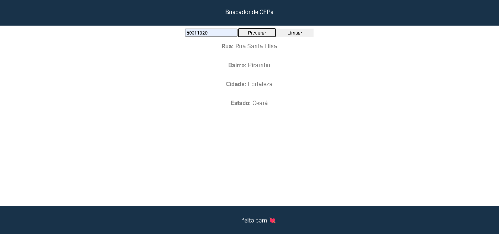

# Projeto buscador de Ceps

O objetivo do projeto é pesquisar CEPs em uma api chamada https://viacep.com.br.

## Design do projeto



## API utilizada

A api https://viacep.com.br. retorna um json contendo as seguintes informações para um cep de exemplo 60311020
```
https://viacep.com.br/ws/60311020/json/
{
  "cep": "60311-020",
  "logradouro": "Rua Santa Elisa",
  "complemento": "até 498/499",
  "unidade": "",
  "bairro": "Pirambu",
  "localidade": "Fortaleza",
  "uf": "CE",
  "estado": "Ceará",
  "regiao": "Nordeste",
  "ibge": "2304400",
  "gia": "",
  "ddd": "85",
  "siafi": "1389"
}
```
## funcionalidades

- [x] Busca do cep
- [x] limpar dados
- [ ] responsividade
- [x] rodapé
- [ ] melhorando o desing

### Observações
> [!NOTE]
> Projeto feito na disciplina de programação webi I do curso ADS do ifce de jaguaruana

> [!IMPORTANT]
> Alguns CEPs podem não conter todas as informações.

## Contatos
Email: flugelddlc@gmail.com